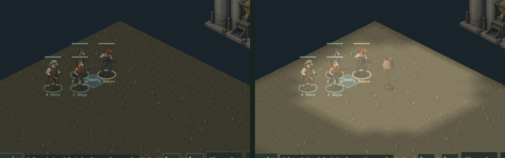
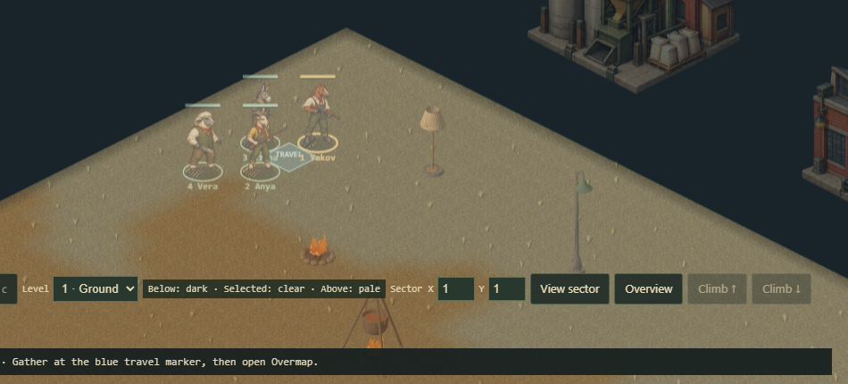

# Artificial light and detection — parcel I

Parcel I of [SCENERY-PORT-HANDOFF.md](SCENERY-PORT-HANDOFF.md): lamps and fires give light at night,
and light decides how far away an animal can be seen. Spotlight and tower beams are parcel J.



*The real game (`index.html?map=custom`, a playtest map starting at 00:00, one goat guard 37 tiles east
of the squad, facing it), shot headless. With no lamp the log reads "Local map ready". With a floor lamp
two tiles from the squad it reads "CONTACT … You have been seen". At noon, with no lamp, it reads
CONTACT too, exactly as before this parcel.*

## The rule

Two decisions from the boss, 24 September 2026:
- **Night hides you.**
- **"15 is good, but the full distance if someone is illuminated by a light."**

So:

```
light  = min(1, daylight + sum over lit bulbs of falloff(distance), each only if nothing solid is between)
range  = sightRange × (0.25 + 0.75 × light)
```

- **`daylight`** is S2's `daylightStrength`: 1 all day, 0 at night, easing through dawn (05:00–06:00) and
  dusk (18:00–20:00).
  - By day the multiplier is exactly 1, so **every map plays exactly as before until dusk**. A test
    checks that at noon with and without lamps.
- **`sightRange`** is the existing cap: 60 tiles, less for a sneaking target. In the dark, 60 becomes 15.
- **`falloff`** is the 3D branch's `lightBrightness`: 100% within 5 tiles, then half for every 5 more,
  and nothing past 30. So an animal within five tiles of a lit bulb is seen from the full 60. Seven tiles
  away it gets half light and 37.5 tiles, and so on out.
- **The light is the target's own**, at its torso. It is traced from the torso to each bulb through the
  solids that sight and bullets already use, without bodies, and without the fixture's own footprint.
  A wall between a lamp and an animal leaves the animal dark.
- It feeds `perceive`, so it covers both directions: guards seeing the squad, and the squad seeing
  guards. A guard standing under a streetlight is visible from across the yard, and one in the dark is
  not.
- **It shrinks the glimpse lobe too.** A moving target is glimpsed out to the detect range, and that is
  now the lit range as well: in the dark, a moving animal 20 tiles away is not even glimpsed.
- **It lowers the chance of noticing a target that is in sight.** `detectionChance` is
  `.95 − .5 × distance / range`, and the range is now the lit one. At 10 tiles an unlit animal at night
  is noticed with 0.62, against 0.87 by day or in lamplight. This follows from the same rule, "how far
  you can see", and it is tested.
- **Light never gets around the sight cone or line of sight.** It only changes how far the cap reaches.
- **The sneaking floor is scaled too.** A sneaking target's cap has a floor of 8 tiles, and in the
  dark that becomes 2. So a prone, silent sneaker at night is identified only up to 2 tiles away dead
  ahead. The 3D branch has an "at arm's reach, always" rule; whether this game wants one is the boss's
  call, recorded in the handoff.

**What is not changed:** terrain visibility (75 tiles) and the fog of war. At night you still see the
ground; you do not see the animals on it.

## Which lights, and when

`light-sources.js` is the 3D branch's, ported at `b23334c`:
- **Kinds:** all thirteen light forms, with the same bulb offsets and heights, the 30-tile range and the
  stepped falloff.
- **Schedule:** electric lamps come on for the night, 18:00 to 06:00; fires always burn. A prop's
  `lightMode` can force either way: `on` or `off`. A damaged fixture (`condition` below 100) is dark.
- **Rotation:** here a rotated prop is mirrored, `(x, y) → (y, x)`, and the bulb mirrors with the art.
  There it is turned a quarter.
- **Spot sources** (the three towers and `spotlight`) give no light in this parcel. They are aimed
  beams that sweep, and parcel J brings them, under the boss's spotting rule: spotted at once only when
  a guard mans the tower or has line of sight.
- **Not ported:** the 3D branch's `fixturePlacement`, which moves a wall fixture's light 0.48 tile toward
  its wall (north, or east when rotated). Neither wall fixture can be placed yet. The shift lands with
  the edge convention (open question 5, answered as "any wall"), and until then `placedEmitters` uses
  the footprint centre for every kind.

**The editor:** a Light selector beside Rotate, with the options Automatic, Always on and Off.
- Automatic is recorded as no field at all, so maps that never use it are unchanged.
- On and off are recorded only on light kinds: lamps, fires and the spot kinds, which J will read.
- The field survives export, import and reload, which is tested.

## Clock, and detection as the light changes

The campaign clock lives on the world. A map's game state now holds the **same object**: `world.js`
hands it over when it creates the first map and on travel, and both are tested. A game with no world
reads the map's own start time, or 08:00. That is `stateMinutes`.

**Reading the clock is not enough.** Detection is otherwise rechecked only when someone acts, so a squad
standing still at dawn stayed hidden until someone moved. The first review caught that in the real game.

- `tickWorld` now compares `lightEpoch` before and after each tick. The epoch changes every minute while
  daylight eases, and not otherwise, since the lamps switch at 06:00 and 18:00, when daylight is exactly 1.
- When it changes, `tickWorld` runs the engine's `refresh` and moves the state's revision, so the
  interface and every revision-keyed cache follow.
- **In the real game:** a map starting at 05:25, one goat 37 tiles away facing the squad, nobody moving.
  It reads "Local map ready" at 05:28, then **CONTACT, "You have been seen"** at 05:37, with nobody
  moving.
- A world-level test holds everyone still across 25 minutes of dawn and checks the same thing.

## Drawing



The drawn light is the tactical rule itself, not a picture of light:
- **Same light as detection.** Every tile within 15 of a bulb gets the same `lampStrength` sum detection
  uses, from every bulb out to 30. It is measured at a **standing** body's torso, 1.296 tiles up, which
  is `targetHeight` for a standing body.
  - A kneeling (0.864) or prone (0.396) body sits lower and can be shadowed where a standing one is not,
    by a table or the lip of a wall.
  - A test checks drawn against detected light, tile for tile, with bulbs off the tile grid and at several
    heights. The first version measured at 1.0 and its test used floor lamps on whole tiles, where no
    tile ever crossed a band. The review showed that test could not fail.
- **Soft, but stops at walls.** The lit tiles become one pixel each of a small light map, drawn through
  the isometric transform with smoothing.
  - Smoothing lets a pool spill about half a tile past a wall on screen, never in the rule.
- **Over the night wash, under the interface.** `app.js` calls `paintLight` straight after
  `paintDaylight`, additively, for the viewed floor.
  - The brief said S2's `light` pass, under the props. Under the wash the pools read as orange dirt,
    because the wash darkens light as much as ground.
  - Over it, the light lifts the dark, and it lights the animals standing in it.
  - The first version used S2's `overlay` pass, which also brightened the dialogue box and route previews
    drawn before it. Calling `paintLight` straight after `paintDaylight` keeps the interface out of it.
  - Upper floors drawn translucent over the ground are still lifted where a ground pool lies under them.
- **Only on seen ground**, so a lamp in unexplored territory does not give itself away. Clipped to the map.
- **Colour:** the strongest bulb's. Fires are orange (`0xffae55`), electric lamps pale (`0xffe5b2`),
  as on the 3D branch.
- **Strength:** alpha 0.3 at full night, eased by the same daylight curve (0.15 at 19:00). Nothing is
  drawn by day, even for a fire that is burning.

At night the selected animal's sight cone shrinks with the dark to 60 × (0.25 + 0.75 × daylight). That is
what that animal can see of an unlit target. A lit guard can still be seen from further away than the cone
shows.

## Doors, fences and blasts

Opening a door, cutting a fence and blowing a wall change where light reaches, and none of them moves the
state's revision. The engine calls `forgetLight` after each one, which does two things:
- it drops the detection memo;
- it bumps `s.lightVersion`, which the drawing cache watches.

This matters within one step. A guard's move can look first (and fill the memo), then open a door, then
refresh detection, all at one revision. A test opens a door beside a lamp and checks both detection and
the drawing see through it.

## Cost

Measured on this machine:

| what | when | cost |
| --- | --- | --- |
| detection, a night step: 20 lamps, 40 guards × 4 squad, both ways | every step | 21 ms (3.4 ms at noon) |
| drawing cache, 20 lamps, first frame after dusk | once, when the lamps come on | 1.08 s |
| the same, next frame / an ordinary step | every frame / every step | 0.03 ms / 4.4 ms |
| a door opening far from every lamp | when it happens | 4 ms |
| a door opening among all 20 lamps | when it happens | 0.75 s |

- **Detection is memoised per point and height,** for one state revision and one minute. So forty guards
  looking at four animals trace four points, not a hundred and sixty. The minute in the key is
  equivalent: lamps only switch when daylight is 1. It is kept only as a guard.
- **The drawing keeps each bulb's tiles.** When edges change, only bulbs within reach of a changed edge
  are redone, so a door across the map costs a few milliseconds.
- **A map with twenty lamps still pauses for about a second** when they come on together at dusk, and for
  most of that when a door opens among them. Spreading that first computation over several frames is
  recorded below.

## Not done

- **Spotlight and tower beams:** parcel J.
- **The dusk pause on lamp-heavy maps.** It could be spread over several frames.
- **Upper floors.** Light is traced in 3D, and floors block it. Each floor draws its own pools, for its own
  bulbs.
- **The wall fixtures' 0.48 shift** (`fixturePlacement`), which lands with the edge convention.
- **An arm's-reach rule** for the 2-tile sneaking floor at night, if the boss wants one.
- **Flickering flames** on the four fire kinds: B's follow-up.

## Files

Parcel I owns `light-sources.js` and `light-render.js` (both new), `engine.js`'s detection and door
handling, this document and its two figures, and `tests/tactics-light.test.mjs`. Outside that:

- `world.js` (S2):
  - two lines hand the map state the campaign clock;
  - `tickWorld` rechecks detection when the light changes.
- `app.js` (S2):
  - the `paintLight` call after `paintDaylight`;
  - the sight cone's night reach.
- `editor.html`, `editor.js` (S1), `editor-model.js` (S2): the Light selector and its record.
- `SIGHT.md`: a paragraph at the head of the model saying night scales the cap.
- `SCENERY-PORT-HANDOFF.md` and `SCENERY-HANDOFF-2026-09-24.md`: the claim and the delivered record.

## Verification

- `npm run check` passes: 550 tests, 534 before.
- **Mutation rounds,** in a sandbox copy that passed unmutated first. The last run caught 40 of 43.
  - **First round, 26 of 27.** It found three gaps, each now tested:
    - the bedside table is the one lamp with cover, so its own footprint can shadow its bulb;
    - two lamps must not add past daylight;
    - a fire burning at noon must still draw nothing.
    It also found a mismatch where pools overlap: the drawing counted only the bulbs within 15 tiles.
  - **The review's thirteen mutants, re-aimed, plus the new pieces.** Eleven of the reviewer's had
    survived; all are caught now. Three mutants still survive, and each is recorded:
    - the in-bounds check on drawn tiles, **equivalent**: the trace already refuses a ray from off the map.
      It stays because it saves those traces;
    - the minute in the detection memo, **equivalent**, as above;
    - the engine's door wrapper forgetting nothing, **not reached**: no test walks a unit through a door
      in the engine. The effect it guards, light through a newly opened door, is tested through
      `forgetLight` directly.
- **The real game,** with controls: the midnight contact figure above, and the dawn run in "Clock".
- **Review:** round 1 scored 6/10. Its two must-fixes, a stale clock and drawn-versus-detected light,
  are fixed and tested, and so are its should-fixes. The full list is in the PR.
