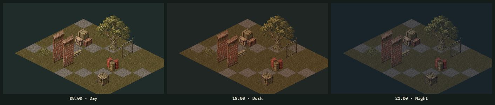

# The day cycle

Parcel S2 of [the scenery port handoff](SCENERY-PORT-HANDOFF.md). The campaign clock
already ran; nothing read the hour. Now the map is washed by the time of day, a map
can say what hour it opens at, and three named passes exist for the scenery parcels
that come next.

## The schedule

`dist/tactics/daylight.js` owns it, and the boundaries are ported from the 3D
branch's `game-clock.js` so the two games agree on what time it is.

| Phase | From | To |
| --- | --- | --- |
| Night | 20:00 | 05:00 |
| Dawn | 05:00 | 06:00 |
| Day | 06:00 | 18:00 |
| Dusk | 18:00 | 20:00 |

`daylightStrength(minutes)` is 0 in the dark and 1 in full day, easing across dawn
and dusk with the same smoothstep the 3D branch uses. A test samples every seventh
minute of the day against that expression, so the two cannot drift apart quietly.

## The wash

This game has no sun. Every sprite is painted with its own upper-left light baked
in, so daylight here is a wash over the finished map, never a relight. Two of them:

- a cool one, `#0e1a2b` at up to 44% opacity, carrying the dark. It scales with
  `1 - strength`, so it is absent at noon and deepest at night.
- a warm one, `#c2661d` at up to 20%, in overlay. It scales with `4s(1-s)`, which
  peaks halfway through a transition and is zero at both full day and full night.
  That is what makes dusk read as different from a dimmed noon.

At midday `daylightWashes` returns an empty list and nothing is painted at all, so
an existing map at the default hour renders exactly as it did before this parcel.

`paintDaylight` is called on the map canvas after the layers composite and before
the interface, so the roster, the cards and the cursor readouts stay untinted.
Shot effects, muzzle flashes and explosions paint after the wash, because they are
light sources.

## When a map opens

A map may carry `time: {startMinutes}`, a whole number from 0 to 1439. The schema
validates it, `parseMap` preserves it, and `mapStartMinutes` resolves it, falling
back to the campaign default of 08:00. `createWorld` starts its clock there, so a
map authored at 21:00 opens at night. Every existing map has no `time` and is
therefore unchanged.

This is the same field the 3D editor writes, so a map authored there arrives here
with its hour intact. In the editor model, `setStartTime(editor, minutes)` sets or
clears it as one undoable edit; wiring a control to it belongs to whoever next
holds `editor.js`.

## The three scene passes

`dist/tactics/scene-passes.js` lets a scenery parcel draw without reopening
`app.js`. Each stage is empty until a parcel fills it in.

| Stage | Drawn | For |
| --- | --- | --- |
| `dressing` | after the terrain, under the props | grass tufts and undergrowth, parcel K |
| `light` | after the dressing, still under the props | lamp and fire pools, parcel I |
| `overlay` | after everything, over the wash | spotlight beams, parcel J |

A pass is `(ctx, view) => void`, where the view is
`{project, zoom, level, bounds, state, minutes}`. `addScenePass` returns a function
that removes it again. The dressing and light stages run once per level inside the
layer compositor; the overlay stage runs once, on the main context.

## Sorting a prop's own pieces

`paint-order.js` gained `propPieceDepth(x, y, side, offset)`. A prop can paint
extra pieces around itself the way burning ground paints flame clumps, each its own
depth-sorted object, so a unit standing on the tile has some in front and some
behind. Walls and fences on the tile's sides sort at ±.5 and a unit on it sorts at
0, so a piece stays within ±.45 and never lands on 0. Parcel B needs this for a
campfire, which has to reach a burning tile's result without pretending to be a
scorch mark.

## What this parcel does not do

No light is emitted: a lamp prop still lights nothing, and the wash is uniform
across the map. Detection does not know about the hour. Nothing registers a scene
pass yet. The editor has no control for the start time. Those are parcels B, I, J
and K.
