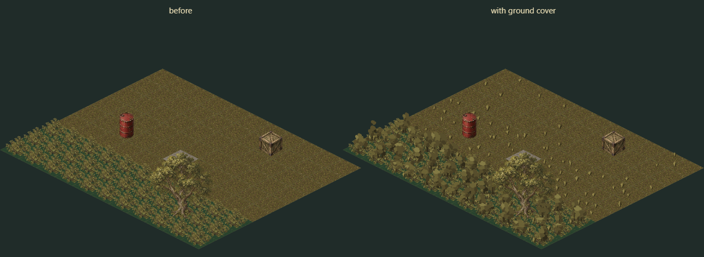

# Ground cover

Parcel K of [the scenery port handoff](SCENERY-PORT-HANDOFF.md). Open ground grew nothing
and a woodland tile was one dark diamond with one bush on it. Now grass has tufts and
woodland has undergrowth, both deterministic, both drawn on the `dressing` pass that
[parcel S2](DAYLIGHT.md) opened.

Review page: [`dist/tactics/ground-cover.html`](../../dist/tactics/ground-cover.html), which
carries the before/after at any zoom, the fogged variant, and every shape magnified.

## What grows where

| Terrain | Tufts | Undergrowth |
| --- | --- | --- |
| `yard` | one, on a third of tiles | — |
| `ground-grass` | two | — |
| `woodland` | two | three |
| everything else | — | — |

A tile under a prop footprint is left bare. The legacy `crate` terrain draws the grass
texture but is not in the list, so it stays bare too.

## Placement is the 3D branch's, hash for hash

`foliage-models.js` on `project/tactics-3d` picks its tufts and undergrowth from a spatial
hash of the tile. The two hash offsets, the index offsets into the random stream, the count
rule and the size ranges here are that function's, so the same map grows its grass in the
same places in both games. A one-off rig imported both implementations and compared them
over 64,800 tiles: 46,795 tuft placements and 32,400 undergrowth placements agreed to the
last bit. The test keeps them agreeing by re-deriving the 3D expression rather than calling
this module twice.

Determinism is the requirement the plan actually names, and it comes from the random being
indexed rather than sequential: `random(7)` is the same number whether or not `random(6)`
was ever asked for. A reload, a camera move and a level switch all re-ask for the same
indices and get the same answers.

## What did not port: the light

The 3D branch shades these at runtime, with a shader that ramps a grass blade from
`#1f3b0e` at the root to `#597526` at the tip and relights the whole thing by the sun. Every
sprite in this game carries its own upper-left light baked into the painting instead, so
there is nothing here to relight. The tones are measured off the artwork the tufts stand
beside:

| Where from | Measured |
| --- | --- |
| `bush.png`, mean of its top-left quadrant | `#6a6135` |
| `bush.png`, mean of its bottom-right quadrant | `#5d5530` |
| `ground-grass.png`, its eight commonest tones | `#473b24` to `#756937` |

That ratio, 95.6 to 83.7 in luma, is the whole of the light direction in the existing
foliage, and it is the ratio the clumps are painted at.

Downscaled to the 50 × 32 px it is actually drawn at, `bush.png` is a speckled olive mound
with no readable leaf detail at all. That is the finding that made procedural shapes viable:
at the size these are drawn, painted leaves and flat blobs are the same picture, so this
parcel needed no new PNGs and adds none.

## Two deliberate departures from the model

**A tuft is drawn twice as tall as its box.** The 3D size box is `.10` to `.195` units, which
is 3.4 to 6.7 px here: wider than it is tall. At that size a clump of blades averages down
into a dark smear that reads as a stain on the grass, not as grass. In the 3D scene the
individual blades carry it; a sprite has to carry it in silhouette. `TUFT_LIFT` is 2, and it
changes only how tall the blades stand: placement, count, spread and determinism are
untouched. Even doubled, a tuft tops out at 13 px against the bush's 32.

**A blade is about two box units thick.** At one unit the stroke came out under a screen
pixel and faded to nothing in the downscale — the first version of this parcel was invisible
on grass, and the fix was thickness and tonal range, not size. The tuft tones reach luma 137
and 42 against a ground whose own noise runs 44 to 105, so a tuft reads as a shape rather
than as more speckle.

## The woodland bush stays

`environment-renderer.js` still paints the dark diamond and the one bush sprite for a
woodland tile, and the undergrowth goes on top of them: the dressing pass runs after the
terrain, so the bush ends up reading as the tile's canopy with the scrub filling in beneath.
The plan describes the undergrowth as replacing them. Removing them would mean editing a
file parcel S1 owns, and the layered result is better than either alone, so the replacement
is deliberately not done. Whoever next holds `environment-renderer.js` can decide.

## Cost

One `drawImage` per piece, from a cache of 18 small bitmaps: six tuft shapes and six clump
shapes, the clumps twice over for the pale tone, each re-rendered only when the zoom crosses
a 1.5× step. A fogged tile stamps a second copy of the bitmap with `#182c2899` already
composited into it, which is the same wash `drawTerrain` paints over a remembered tile — the
dressing draws after that wash, so it has to carry its own.

Tufts fade in between zoom .30 and .55 and undergrowth between .18 and .38, over a band
rather than at a threshold, because below that a tuft is one dark pixel and a screenful of
them only muddies the ground. In the reference yard, 99 tiles cost 236 stamps at full zoom,
96 at zoom .25 and none at .15.

Within a tile the three clumps sort back to front, and the whole pass walks the view in
`x + y` order rather than by rows, because a clump is up to 39 px tall and leans over the
tile in front of it.

## What this parcel does not do

No mechanic changes. Woodland already costs nine tiles of optical distance per tile crossed
and already multiplies acquisition by `exp(-depth × 0.35)`; `woodland.js` already measures
the exact ray length, and none of it is touched. A test runs a ray through woodland before
and after the map is dressed and asserts the same depth, and that the pass writes nothing to
the state it is handed.

Cover never sorts against a unit: a unit standing on a tile is always in front of that
tile's dressing, exactly as it is already always in front of the bush. Nothing grows on
upper floors that are not grass, nothing grows on water, and the editor has no brush for it
because there is nothing to author — the terrain decides.
