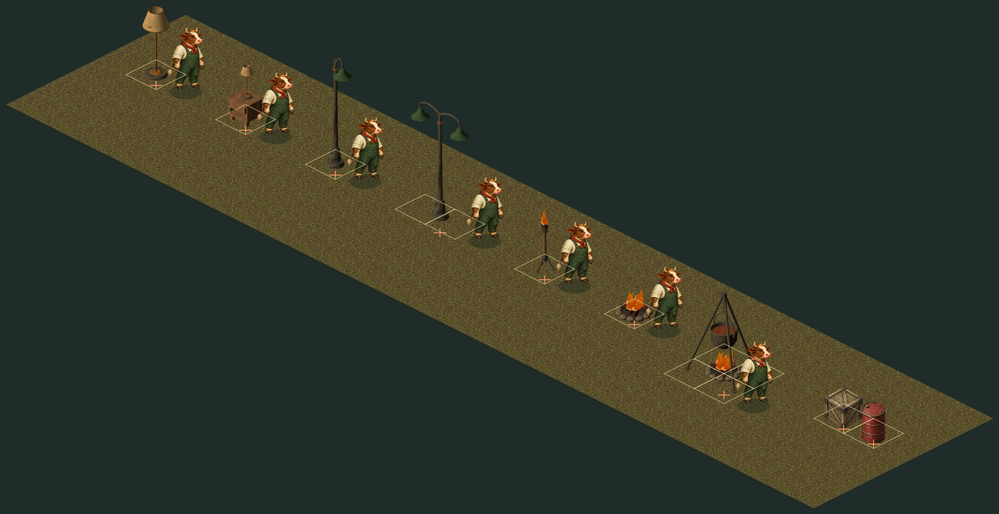
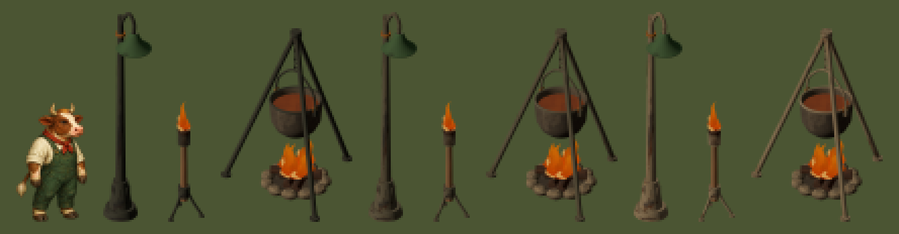
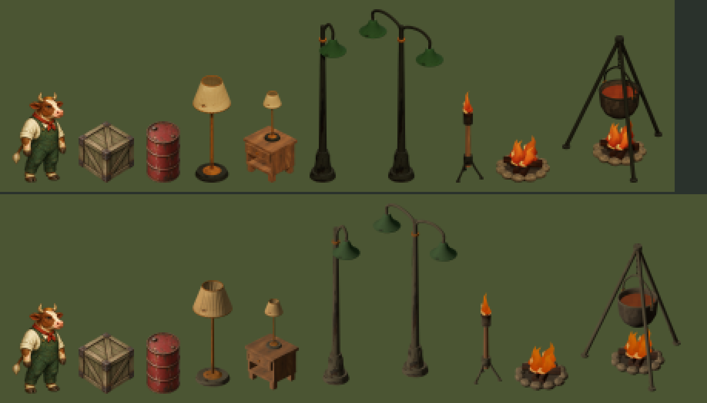

# Lamps and fires — parcel B

Written 23 September 2026. Parcel B of [SCENERY-PORT-HANDOFF.md](SCENERY-PORT-HANDOFF.md):
the light fixtures of the 3D branch, as sprites, on the tiles the 3D editor puts them on. Art
and placement only. Nothing here emits light; that is parcel I.



*Drawn by `environment-renderer.js` at zoom 2 on the review page, `dist/tactics/lighting-art.html`.
The pale diamonds are the footprints and the orange crosses are where the renderer plants a
sprite's bottom. Every fixture stands on the middle of its own footprint.*

## What shipped

Seven kinds, all from `painted-furniture.js` on `project/tactics-3d`, honey finish:

| kind | tiles | drawn at zoom 1 | cover | downscale |
| --- | --- | --- | --- | --- |
| `floor-lamp` | 1 × 1 | 26 × 74 | — | 15.4 : 1 |
| `bedside-table-lamp` | 1 × 1 | 35 × 62 | 25 | 17.8 : 1 |
| `streetlight` | 1 × 1 | 32 × 110 | — | 10.2 : 1 |
| `streetlight-double` | 2 × 1 | 55 × 124 | — | 9.0 : 1 |
| `standing-torch` | 1 × 1 | 21 × 66 | — | 16.1 : 1 |
| `campfire` | 1 × 1 | 35 × 34 | — | 23.4 : 1 |
| `cooking-fire` | 2 × 2 | 74 × 98 | — | 10.0 : 1 |

The drawn box is the model at true world scale. It is extended down to the renderer's anchor
and made symmetric about the footprint centre by two invisible registration marks (below), so
it is a little wider and taller than the visible model. A standing animal is 59 px tall. A
floor lamp stands a head taller than a cow, and a streetlight nearly twice it.

The rules are the 3D branch's own, not a guess. Its `core/environment.js` does
`Object.assign(PROPS, LIGHT_PROPS)`, and `light-sources.js` builds each as
`{w, h, solid: !wall, cover: kind === 'bedside-table-lamp' ? 25 : 0}`. So every fixture blocks
its tile, only the bedside table is cover, and none is `tall`, which here is what blocks sight.
A map authored on either branch loads on the other, and the `lightMode` the 3D editor writes
onto a placed fixture survives a load here for parcel I to read.

## These are relit bakes, not paintings — a stated deviation

The plan says a render is an underlay and never the deliverable, and every painting in the
catalogue came out of Codex's built-in image generator (`art/environment-sources.json`). This
session has no image generator. B therefore ships bakes. **That is this parcel's deviation from
the plan, not a change to the plan's rule**; whether other parcels may do the same is
**open question 9** for the architect. A painter can still paint over them. A repaint loses the two registration pixels, so restore them
with `node tools/bake-scenery.mjs --remark=dist/assets/environment/manifest-lighting.json`,
which needs no browser and puts them back from the footprint centre and scale each asset
recorded, then run `catalog-environment.py`. Done that way, the catalog rows do not change. Skip
it and the fixtures float again, and `tests/tactics-lighting.test.mjs` fails.

What made the deviation defensible is a measurement. The plan's objection is that the 3D branch
shades at runtime while a sprite carries its own light, so the light was measured, at the size
the game draws the things, on the two subjects both lines have:

| | luma | sd | TL ÷ BR | saturation |
| --- | --- | --- | --- | --- |
| painted `crate-wood` | 82 | 30.2 | 1.92 | 0.44 |
| baked crate, workshop light | 104 | 18.9 | 1.23 | 0.48 |
| baked crate, **catalogue rig** | 83 | 29.6 | 2.19 | 0.41 |
| painted `barrel-single` | 64 | 24.4 | 2.26 | 0.64 |
| baked barrel, **catalogue rig** | 50 | 18.6 | 2.26 | 0.67 |

TL ÷ BR is the upper-left quadrant's mean luma over the lower-right's, which is the light
direction. The workshop's sun stands at (5, 7, 6) and lights the two visible side faces almost
equally, so its bakes come out flat, bright and directionless. The painted catalogue is lit hard
from the upper left. `--light=catalogue` puts one key light at (−1, 2, 3) with a hemisphere fill.
The crate then matches the painting on every measure. The barrel stays darker because the 3D
skins run darker than the painted palette, which is albedo, not light.

**The rig was fitted on one crate and checked on one barrel, and it missed the iron.** The 3D
iron is one fixed colour, `0x343b37`, in every finish, and it baked the streetlights near-black
(median luma 39, against 70 for `jail-bars`, the painted catalogue's iron). The rig re-tints the
iron for the bake only, to `0x5c5f58`. It took three tries, and each failure taught something:

- `0xbca480` matched `jail-bars`' *mean* colour best and read as tan wood, next to a torch that
  really is wood.
- `0x8c887e` matched its brightness (luma p10/p50/p90 32/65/103 against 28/70/129) and
  **inverted the cooking fire**, as the second review caught. The pot keeps its own colour,
  `0x65615a`, and a tint lighter than that hangs a dark pot from pale legs. A tint has to keep
  the source's dark-to-light order, not just hit a number.
- `0x5c5f58` stays under the pot (colour-factor luma 93.3 against 97.4, now a test), bakes the
  streetlight at 20/51/75, reads as weathered iron with its form, and keeps thin legs visible
  against grass. That is darker than the painted `jail-bars`, deliberately. The test compares
  material colours, not albedo: both multiply textured atlas cells, so in the shipped
  `cooking-fire.png` the order holds by less (median luma 51 on the lit leg, 55 on the pot body,
  measured by the third review).



*Left to right, in three groups: iron as built, `0x5c5f58` (shipped), `0x8c887e` (rejected:
pale tripod, dark pot). Each group is a streetlight, a standing torch and the cooking fire.*

The `iron` material is shared by the cargo, tower and furniture libraries, so any parcel that
opts into `--light=catalogue` gets this tint on its iron too.



Two traps the calibration turned up, both handled in the tool:

- **ACES tone mapping overshot the light direction on every rig tried**, to 2.5 to 9 where the
  paintings are about 2, so the rig renders without it.
- **With tone mapping off, three.js ignores `toneMappingExposure`.** The first sweep had an
  exposure knob that did nothing at every value. Brightness is a `gain` on both lights.

`--light=page` is still the baker's default; the catalogue rig is opt-in.

## Registration: two invisible marks

`environment-renderer.js` plants a crop's bottom centre `(w + h) * 5` px below the footprint
centre, and no prop field can move that point (SCENERY-BAKE.md, "The registration contract").
The rule assumes a subject that fills most of its footprint. A lamp on a round base doesn't, so
its bottom is above the anchor, and every one of these would have been drawn low:

| | residual before | after, at bake scale | after, as drawn at zoom 1 |
| --- | --- | --- | --- |
| `streetlight-double` | −10.6 px | 0.0 | 0.14 |
| `standing-torch` | −6.1, 1.2 off-centre | 0.0 | 0.02 |
| `streetlight` | −5.6, 3.6 off-centre | 0.0 | 0.04 |
| `floor-lamp` | −4.5 | 0.0 | 0.01 |
| `bedside-table-lamp` | −2.5 | 0.0 | 0.04 |
| `campfire` | −2.3 | 0.0 | 0.06 |
| `cooking-fire` | −1.5, 4.6 off-centre | 0.0 | 0.02 |

The last column is vertical; horizontally every one is within 0.011 px. It is not zero because
the renderer draws at `min(visualWidth / cropWidth, visualHeight / cropHeight)`, and the box
sides are whole pixels, so the drawn scale is a little off the bake's. The anchor sits
`(w + h) * 5` px below the centre, so the error is that times the scale error: largest for the
2 × 1 `streetlight-double`, about two thirds of a screen pixel at the 4.6× maximum view.

`bake-scenery.mjs --register` puts two pixels on the anchor row, one either side of the
footprint centre at the same distance, just clear of the model. The renderer's alpha ≥ 64 crop
then ends exactly on the anchor and is centred exactly on the footprint. They are drawn at alpha
64, the crop threshold itself. The second review located each mark on screen at zoom 0.6, 1, 1.15
and 3, and at all 28 positions the pixel is within the grass texture's own variation.

That is a measurement, not a guarantee. The renderer leaves `imageSmoothingQuality` at its default
`low`, which may sample bilinearly without averaging a large downscale. So at some sub-pixel
positions, most plausibly while panning at the 4.6× maximum, a mark could land as one screen pixel
of `#13241d` at up to 25% opacity. Nobody has seen it happen.

The picture is otherwise exactly the model, as in the painted catalogue, with no cast shadow.

The marks sit exactly at the threshold, with no margin. Anything that rewrites alpha — a lossy PNG
optimiser, a premultiplied round trip — can drop them to 63 and silently move the crop.
`tests/tactics-lighting.test.mjs` checks the bottom row for exactly the two marks, so that fails
loudly, and `--remark` puts them back.

An earlier version of this parcel registered the sprites with a visible ground-contact ellipse
instead. The review rejected it. Its size was a choice presented as a constraint, it was larger
than a unit's own shadow, it read as a dark mat under the cooking fire, the painted neighbours
have no such thing, and the plan says no cast shadow. The marks do the registration and nothing
else.

They are a stopgap that works with today's renderer. **The bedrock fix is a registration field
on the prop record**, which the wall fixtures need anyway (open question 5). With one, the marks
go away.

**Since parcel C, that field exists.** `foot`, the footprint centre the bake recorded, is copied
into `prop-art-lighting.js`, and the renderer plants the lamps by it, which also removes the
as-drawn residual in the table above. The marks are now redundant but harmless: the tests above
still hold them, and `--remark` still restores them. Removing them is a cleanup for whoever
next re-bakes the lamps. See [TOWERS.md](TOWERS.md).

`tests/tactics-lighting.test.mjs` checks the registration against numbers recorded at bake time,
not against the tool that made the PNGs. `manifest-lighting.json` carries each sprite's
`footCentre` (where the footprint centre fell, in that PNG's pixels) and `gameScale`. The test
asserts that the crop ends `(w + h) * 5` below that point and is centred on it to within 0.1 game
px, and that the crop's bottom row is exactly the two marks. Then, independently of the bake's
bookkeeping, it checks the round-based fixtures: the floor lamp and both streetlights stand on
their centre, so the centroid of the lowest band of solid pixels must be the recorded footprint
centre. All three sit within 0.01 game px of it.

## Rotation is a mirror here and a quarter turn there

A rotated prop in this game swaps its footprint and is drawn with `scale(-1, 1)`: a transpose,
`(x, y) → (y, x)`. The 3D branch rotates a quarter turn, `(x, y) → (−y, x)`. For a rectangle the
two occupy the same cells, so collision, cover and map interchange agree, and for these seven,
whose pictures are symmetric or nearly so, the drawing agrees too. They disagree about anything
asymmetric *within* the tile:

- **A wall fixture.** The 3D branch mounts a rotated one on the tile's east edge
  (`fixturePlacement`, `x + .48`). Mirroring the north-mounted sprite puts it on the **west**
  edge. Porting `fixturePlacement` as-is would hang a rotated wall torch on the opposite wall.
- **The bedside lamp's drawer and bulb.** Its emitter is 0.045 tile off centre. Parcel I must map
  emitters through the mirror, not through the 3D branch's `placedEmitters`, or the light comes
  from the wrong side of the table on a rotated one.
- **Light direction.** A mirrored sprite is lit from the upper right. The whole painted catalogue
  has the same property, so it matches its neighbours.

## What this parcel does not do

- **The wall torch and the gooseneck sconce.** Open question 5. They bake 36 and 52 px from
  where the renderer would plant them, and marks can't help, because their footprint centre is
  off the bottom of the canvas and nowhere near the subject. Until they land, **a 3D map
  carrying either is refused here** with `Invalid environment props.`, the same kind of live
  incompatibility parcel A fixed for mature trees. Both are listed in `DEFERRED` in
  `environment-props-lighting.js`. A test fails if the baker's `lighting` group ever holds a
  form that is neither shipped nor deferred, and another pins the refusal.
- **Flickering flames.** The three fires hold still. Their flames are the 3D branch's
  low-poly tongues drawn unlit: flat orange with paler facets, and no core or outline, which
  `flame-effect.js`'s rule would give them. They pass at 1.15 and look papery at 2 to 3. The
  fix is the tree's own fire idiom: `ground-fire.js` draws flame clumps as separate
  depth-sorted objects, and S2's `propPieceDepth` has the depth rule for that. But nothing in
  `app.js` pushes prop pieces into the sort, and `app.js` is not this parcel's. When it does,
  re-bake the three fires with their flame meshes hidden and draw clumps from `ground-fire.js`,
  honouring reduced motion. This parcel therefore did not touch `flame-effect.js`, which it owns.
- **Light.** Nothing emits. Parcel I reads `lightMode`, which survives load and export.
- **Scale.** These are at the 3D line's world scale, about 9% taller relative to the sprite
  sheet's animals (open question 8). The whole-pixel box moves the drawn scale by at most half a
  pixel on the side that binds: `streetlight-double`'s width rounds 55.49 down to 55 and draws
  0.9% small. The test bounds exactly that.

## Files this parcel touched

The Stage 1 Owns row for `lighting`: `dist/assets/environment/lighting/*`,
`environment-props-lighting.js`, `prop-art-lighting.js`, `manifest-lighting.json`,
`lighting-art.html`, `art/lighting-prompts.md`, `tests/tactics-lighting.test.mjs`, and this
document with its three figures.

Outside it, all of it under the plan's tools carve-out or recording what the parcel found:

- `tools/bake-scenery.mjs`: `--light`, the rig table and its iron tint, `--register`,
  `--remark` and the marks, and refusing unknown or misformed options.
  `tests/tactics-bake-scenery.test.mjs`: their tests. `SCENERY-BAKE.md`: their documentation.
- `tools/drawn-size.mjs`: it read `PROP_ART` only and could not see a single group prop, and its
  main guard crashed when imported from `node -e`.
- `SCENERY-PORT-HANDOFF.md`: the claim, the status row, B's delivered record, a finding under
  open question 5, the new open question 9, and a note on the new-props sweep. Also four smaller
  edits: a *Parcel B* note under the sprite-aesthetic rule, the tooling-table rows for the
  baker's new options, the flame hook under "not covered anywhere yet", and a paragraph in
  **parcel C's** section saying the 3D branch has moved since the underlays were baked
  (`82e60cf..ec13c4a` adds a `wideExit` option to one tower, `iron-searchlight-ladder-tower`),
  so C re-bakes first.
- `MAKING-SCENERY.md`: the new-props sweep does not see group props, which that document had told
  parcels to rely on.
- `SCENERY-PORT-FIELD-NOTES.md`: traps from this parcel, each marked *(parcel B)*.

Not touched, though found: `tests/tactics-new-props.test.mjs` reads `PROP_ART` only and so
sweeps no Stage 1 prop. It is a shared file. B tests its own placement round trip, and the plan
asks the integrator to widen it.

## Verification

- `npm run check` passes; the count is in the PR, with the tests on the baker's rig, marks and
  refusals and on the parcel.
- Mutation rounds on the parcel and the tool, all caught: shadow or mark geometry, compositing
  order, canvas checks, the rig table and tint, every catalog field that matters, the crop
  table, and `drawn-size`'s view of group art. The mutation list is in the commit messages.
- The review page renders all nine props with no console errors at zoom 0.6, 1, 1.15, 2 and 3,
  in both orientations.
- One independent hostile review, as the plan requires, in rounds:
  - **Round 1, 7/10.** The visible shadow was replaced by marks. Policy went back to the
    architect as open question 9, with `--light=page` restored as the default. The iron was
    re-tinted. Registration is now tested against recorded numbers and independent geometry.
    The rotation advice for open question 5 was corrected, and the file list written down.
  - **Round 2, 8/10.** The reviewer confirmed that none of those was papered over, and that
    all seven sprites register within 0.032 px vertically and 0.011 px horizontally at bake
    scale. Two
    new findings, both fixed: the tint inverted the cooking fire, and the repaint promise was
    false without a way to restore the marks, which is now `--remark`. From its worth-noting
    list: the invisibility claim is softened, the zero-margin threshold is recorded, and the
    tool refuses unknown options, so `--shadow` no longer passes silently.
  - **Round 3, 9/10, the plan's gate.** A fresh reviewer re-derived registration by simulating
    the renderer against the shipped files (the "as drawn" column above), ran 12 mutations of
    its own on the parcel test (all caught), re-ran `catalog-environment.py` and `--remark` on
    copies (identical), and checked the rules against `ec13c4a`. Its one must-fix was the PR
    title, which still named the rejected shadow. Its should-fixes, both done: the tool now
    refuses known options in the wrong form too (`--register=true`, `--light catalogue`, a bare
    `--remark`, which would have baked all 44 forms over the committed underlays); and this
    file list and the plan's review line had not kept up. From its worth-noting list: the drawn
    residuals above, `marksFit` now agrees with the canvas-edge check, `--remark` strips marks
    only on the bottom row so paint of the same colour survives, the tint test's wording, and
    the nine kinds spelled out in the parcel test. Not taken: rounding `streetlight-double` to
    56 px wide to trade its 0.14 px for about 0.02; and an independent vertical check from the
    base's ellipse, which agrees with the recorded centres to about 0.2 game px.
- `--remark` checked end to end: strip the 14 mark pixels from copies of the seven PNGs, restore
  them from the manifest, and all seven are byte-identical to the shipped files.

## Reproducing the art

```
git worktree add --detach ../af-3dref 8e7140f        # or any later commit with the same painted-furniture.js lighting forms
cd ../af-3dref && PORT=4319 node tools/serve.mjs
node tools/bake-scenery.mjs --group=lighting --light=catalogue --register --out=<scratch>
```

then copy the seven PNGs into `dist/assets/environment/lighting/`, record each row's
`footCentre` and `gameScale` in `manifest-lighting.json`, and run
`python tools/catalog-environment.py`. That script rewrites every group's `prop-art-*.js`. On
Windows the rewrite changes only line endings in the others, so restore them rather than
committing them. Provenance is in `art/lighting-prompts.md`.
