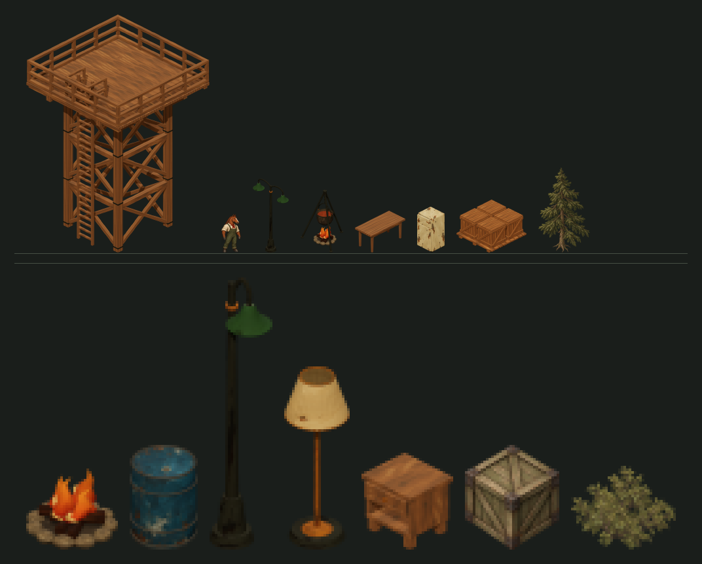

# Baking scenery out of the 3D models

Opened 23 September 2026. `tools/bake-scenery.mjs` photographs the 3D branch's painted art
libraries through this game's own camera and reports what a catalog row would have to say
for the result to land on the right tile. It is the tool
[MAKING-SCENERY.md](MAKING-SCENERY.md) calls the **bake** route, and it covers the four
Stage 1 groups whose models exist: `lighting` (parcel B), `towers` (C), `furniture` (E) and
`cargo` (D).

**Under the workshop's own light, a render is an underlay.** The 3D branch shades its materials
at runtime; a sprite carries its own light and its own painted grain. Look at the bottom row of
`scenery-bake.png`, which was baked that way, and the difference is plain — the baked pieces are
cleaner and flatter than the painted `crate-wood` and `bush` beside them. What a bake gives
you for free is the silhouette, the projection, the proportions and the registration.

**Parcel B measured the objection, and it is about light.** The workshop's sun lights both
visible faces almost equally; the paintings are lit hard from the upper left. `--light=catalogue`
(opt-in; `page` stays the default) relights the bake to match the painted catalogue at drawn
size, and `--register` lands a floor-standing subject on its tile exactly. B shipped its seven
fixtures as relit bakes, **as a stated deviation for that parcel**; whether any other parcel may
ship a bake is open question 9 in the plan, not settled here. The numbers are in the section below
and in [LIGHTING.md](LIGHTING.md). B's call was made at 9–23 : 1; a tower at 2.4 : 1 shows far more
of whatever grain a painting would have had.



*Top, 1:1 at zoom 1: `wooden-guard-tower` 280 × 364, a standing animal 30 × 59,
`streetlight-double` 55 × 113, `cooking-fire` 65 × 96, `dining-table` 77 × 64,
`refrigerator` 42 × 70, `crate-pallet` 107 × 81, and the painted `tree-pine` 79 × 130 for
comparison. Bottom, magnified 4×: `campfire`, `barrel-single`, `streetlight`, `floor-lamp`,
`bedside-table`, then the painted `crate-wood` and `bush`.*

## Running it

```
git remote add codex "C:/Users/baals/Local Storage/AI/GTP/animal-factory"
git fetch codex "refs/heads/*:refs/remotes/codex/*"
git worktree add --detach ../af-3dref codex/project/tactics-3d
cd ../af-3dref && PORT=4319 node tools/serve.mjs
```

then, from this tree:

```
node tools/bake-scenery.mjs --list                       groups and forms, no browser needed
node tools/bake-scenery.mjs --calibrate                  the camera, and the 59 px animal datum
node tools/bake-scenery.mjs --group=lighting
node tools/bake-scenery.mjs --form=campfire --skin=all
node tools/bake-scenery.mjs                              all 44 forms, about eight seconds
```

It needs `playwright-core` and an installed Edge; pass `--playwright=<path>` or set
`PLAYWRIGHT_PATH` if it is not resolvable from this tree. Output lands in
`docs/tactics/scenery-bake/out/`, which is gitignored. **Do not bake into
`dist/assets/environment/`** — `check-assets.mjs` fails on any unreferenced PNG there, so an
underlay parked in the asset tree breaks the build.

## What the manifest says

`out/bake-manifest.json` carries one row per baked form. The fields that matter:

| field | meaning |
| --- | --- |
| `crop` | the alpha ≥ 64 box, exclusive on the far edge — the same rule the renderer crops by |
| `drawn` | what the model measures in game pixels at zoom 1, at true world scale |
| `visualWidth`, `visualHeight` | `drawn` rounded; put these in the prop record and the renderer reproduces true scale |
| `defaultBox` | what the prop would be squeezed into with no overrides, for comparison |
| `anchor` | where the renderer plants the sprite's bottom, where the model's bottom really is, and the difference |
| `centre` | how far the crop's horizontal centre sits from the footprint centre |
| `footCentre`, `gameScale` | the two numbers every residual above is measured from, so the arithmetic can be redone |

Setting **both** `visualWidth` and `visualHeight` to the drawn size is what makes the
renderer land on exactly that scale, because `min(maxWidth / cropWidth, maxHeight /
cropHeight)` then has two equal arguments. Setting only one leaves the other free and the
other may bind.

Most of these forms overflow `defaultBox` badly, which is the practical payload. A 5 × 5
tower's default box is 250 × 153 px and the tower is 280 × 364. Parcel C could not have
guessed that number and now does not have to.

## The registration contract

`environment-renderer.js` draws a prop in three steps, and only the first is negotiable:

1. fit the crop into the box, `scale = min(maxWidth / cropWidth, maxHeight / cropHeight)`;
2. take the footprint centre, `project(x + (w-1)/2, y + (h-1)/2)`, and push it down
   `(w + h) * 5 * zoom` pixels;
3. plant the crop's **bottom centre** there.

So a sprite is registered by the bottom and the horizontal middle of its own alpha box.
Nothing in a prop record moves that point. The footprint diamond's true bottom vertex is
`(w + h) * 7` below the centre, not `(w + h) * 5`, so the rule assumes art whose base is
inset from the tiles it claims — which is exactly how the existing catalogue is painted.

## Light, and registration

Two options added by parcel B. Neither changes the geometry numbers in the manifest, and both
are recorded on each row (`light`, `register`).

**`--light=page | catalogue`**, default `page`. `catalogue` switches the page's lights off and
puts one key light at (−1, 2, 3) with a hemisphere fill, no tone mapping, the flame meshes drawn
unlit, and the 3D `iron` material re-tinted from `0x343b37` to `0x5c5f58`. It was calibrated
against the subjects both lines have, measured at drawn size:

| | luma | sd | TL ÷ BR | saturation |
| --- | --- | --- | --- | --- |
| painted `crate-wood` | 82 | 30.2 | 1.92 | 0.44 |
| baked crate, `page` | 104 | 18.9 | 1.23 | 0.48 |
| baked crate, `catalogue` | 83 | 29.6 | 2.19 | 0.41 |

and for the iron, luma p10/p50/p90 of a baked streetlight against painted `jail-bars`: 9/39/63
as built, 20/51/75 re-tinted, 28/70/129 painted. The tint stays darker than the cooking pot the
iron tripod holds (`0x65615a`): a lighter one, tried, inverts that object, so a tint must keep
the source's order, not only hit a number. ACES tone mapping overshot the light direction
on every rig tried. And with tone mapping off, three.js ignores `toneMappingExposure`, so
brightness is a `gain` on the lights. An unknown `--light` is refused, not quietly treated as
`page`. The rig was fitted on one crate and a few metals; check anything new against its
painted neighbour at drawn size before trusting it.

**`--register`.** Puts two pixels, `#13241d` at alpha 64 (the crop threshold), on the
renderer's anchor row, symmetric about the footprint centre and just clear of the model. The
alpha crop then ends exactly on the anchor and is centred on the footprint, so a subject that
would float is registered with a residual of zero both ways. At drawn size the marks are
invisible. They can only move a crop's bottom *down*: a subject that sinks still shows in the
manifest, which recomputes residuals from the marked image. If the marks would leave the canvas,
the tool retries the tighter fit; if that fails too it bakes without them and says so. A wall
fixture is that case. A registration field on the prop record would make the marks unnecessary;
see open question 5.

**`--remark=<side manifest>`.** Restores the marks on PNGs that already exist, a repaint most
likely, from the `footCentre` and `gameScale` each asset recorded at bake time. It needs no
browser, strips any existing marks first so running it twice changes nothing, and refuses when the
marks would leave the canvas. Stripping and restoring the seven shipped lighting sprites gives
byte-identical files.

## What cannot be fixed here

The two residuals in the manifest are the renderer's, not the bake's, and no output
resolution or framing choice touches them. Measured across all 44 forms:

| | forms | worst |
| --- | --- | --- |
| sit **above** the anchor and would float | 19 | `gooseneck-sconce` −51.8 px |
| sit **below** it and would sink | 13 | `wood-large-wrap-tower` +26.6 px |
| off-centre by more than 2 px | 11 | `wood-ladder-tower` −20.7 px |

Most are small — the whole `furniture` group is inside ±4.5 px, and `cargo` inside ±5. Three
clusters are not, and each one lands on an open question the plan already has:

**The two wall fixtures are off by one to two tile heights.** `gooseneck-sconce` hangs 41.8 px
*above* its own tile centre, so the renderer would drop it 51.8 px to the floor and shift it
10.6 px sideways; `wall-torch` is −36.1 and −4.4. That settles the shape of **open question 5**:
a wall-mounted prop is not a rounding problem to be painted around, it is off by more than a
whole tile, and B needs a real edge-mounting convention before it can finish.

**The stair and wrap towers sink 10 to 27 px, and the ladder towers sit 20.7 px off-centre**,
because their declared 6 × 5 and 7 × 7 footprints are not centred on the geometry — the stairs
and the ladder hang off one side. Worth deciding alongside **open question 6**: whatever rule
the towers get for sorting and dimming has to carry an anchoring answer too, because at 364 to
459 px tall these are the props where 20 px of drift is most visible.

**`barrel-pile` is 10.2 px off-centre** and `cooking-fire` −4.6. Those are the ordinary case and
a painter can simply recentre the subject when painting over the underlay.

**Update, parcel B:** for anything that *floats* (the 19), `--register` brings a
floor-standing subject's residual to zero both ways, and did for all seven of B's floor fixtures,
`cooking-fire` included. It can't help the wall fixtures, whose footprint centre is nowhere near
the subject, or anything that sinks.

## The calibration

`--calibrate` measures the camera in the render rather than reading it off the branch, then
bakes the reference horse both painted workshops carry:

```
one ground unit steps 407.136 x 203.568 px  ->  2.000000 : 1   (2.000000 wanted)
one unit of height    steps 498.637 px      ->  1.224745 per ground unit   (1.224745 wanted)
so one bake pixel is 0.068773 game px at zoom 1
```

Both to six decimal places. The tool **refuses to bake** if either is off, because a retilted
camera produces art that looks plausible and is in the wrong projection — the failure mode
`HYBRID-MIGRATION.md`'s stale 35.26°/1.73:1 paragraph would have caused if anyone had
believed it.

The horse is the end-to-end check, and it does not agree exactly. The 3D horse bakes
**64.4 px tall where the sprite sheet's standing animals measure 59** — the 3D line stands
9.1% taller. One corroboration on the other side: `barrel-single` bakes 26 × **40** px and the
painted `barrel-single` is drawn 22 × **40**. So the scale chain is sound and the two lines
genuinely disagree about how big an animal is by about 9%. A parcel placing baked scenery
beside painted characters should know that before deciding whose scale to honour; nothing
here silently corrects it.

## Sizes, and open question 7

How much of a 1254 × 1254 bake the renderer keeps, by group:

| group | forms | drawn at zoom 1 | downscale |
| --- | --- | --- | --- |
| `towers` | 17 | 29 × 109 to 391 × 459 | 2.4 : 1 to 10.2 : 1 |
| `cargo` | 12 | 26 × 40 to 99 × 104 | 9.6 : 1 to 26.3 : 1 |
| `furniture` | 6 | 35 × 37 to 74 × 81 | 14.5 : 1 to 31.1 : 1 |
| `lighting` | 9 | 13 × 50 to 55 × 113 | 9.0 : 1 to 33.4 : 1 |

This sharpens **open question 7** rather than answering it: the right output resolution is not
one number. A tower at 2.4 : 1 is barely oversampled at 1254² and would lose real detail if the
gate shrank; a `wall-torch` at 33 : 1 is thirty times larger than it needs to be. Whatever the
architect decides, it wants to be a per-entry budget rather than a single constant.

## Refusals

The tool stops rather than writing quietly wrong art when:

- the camera is not GAME_CAMERA to within 1e-5 on either ratio;
- the page reported a script error or a 4xx while loading;
- the workshop selected a different form than the one asked for, or left more than one model
  placed because the page was still in collection mode;
- the silhouette touches the canvas edge. It retries once at a 0.92 fit and then refuses —
  this is the defect the 23 September integration review found in the character baker, where
  heading 90 clipped 13 and 7 pixels off the bottom and the run reported it and carried on;
- the frame came back with an empty alpha channel;
- `--light` names a rig the table does not have, or any option is one the tool does not know
  (a mistyped or retired flag would otherwise be ignored and the run would look fine);
- the page's form list no longer matches the `GROUPS` table, in either direction. A form the
  3D branch adds is a form no parcel will paint, and a form it removes is a stale plan entry.
  Both fail the whole run instead of leaving a gap in the manifest.

## Adding a page

Three libraries are not adapted, and all three are blocked on open question 1 anyway.

- **`machines` (F)** and **`vehicles` (H)**: `factory-machines.html` and `canvas-truck.html`
  expose `machineStudy` / `truckStudy` as `{ready, scene, trucks, render, diagnostics}`. Each
  page carries one model in two levels of detail — `trucks.author` and `trucks['10k']` — and
  has no form selector, so the adapter picks a variant and hides the other rather than calling
  `select()`. The machines page also fetches three datasets (lathe, mill, press); check which
  one is mounted before assuming.
- **`conveyor` (G)**: `painted-conveyor.html` is a tile editor. `conveyorWorkshop` offers
  `{cells, edit, preset, masks}` and no forms at all, because the subject is a laid-out run.
  G wants one bake per neighbour mask — the sixteen-mask pattern `shore-tiles.js` already uses
  in this tree — not one per form, so it needs its own driver rather than another adapter.

A new adapter needs exactly four things: the page file, the global hook name, a way to select
one subject, and a way to reach the scene from it. Everything after that — camera, framing,
clipping retry, crop, catalog arithmetic — is shared and already tested.

## Tests

`tests/tactics-bake-scenery.test.mjs` covers the part that does not need a browser: the camera
guard, the crop rule, the catalog arithmetic and the group partition, and since parcel B the
light table, the registration marks' placement, that they never overwrite the model, and their canvas check. Its
fixtures are two real manifest rows rather than invented numbers, and the camera probe is a
recorded measurement rather than a recomputation of the tool's own formula. Fourteen deliberate
mutations, fourteen caught. Parcel B's rounds added more across the tool and the parcel, all
caught; the lists are in its commit messages.
