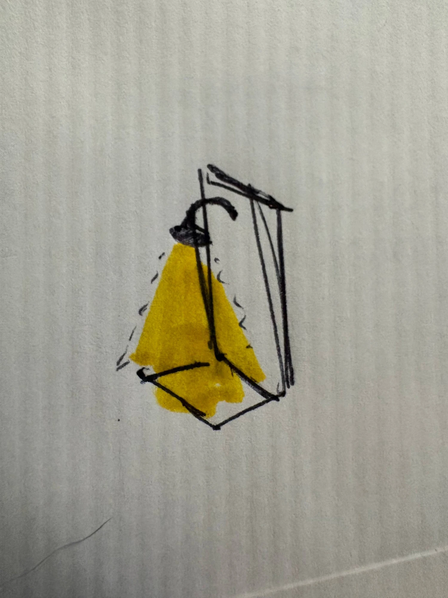

# Scenery port: what is left, 24 September 2026

Start here if you are picking up the scenery port. The plan itself is
[SCENERY-PORT-HANDOFF.md](SCENERY-PORT-HANDOFF.md), and it holds every parcel's full brief and delivered
record. This page is the short list of what is **not** done, in the order I would take it, and what
each item waits on.

Parcels A, S1, S2 and K are merged. B (lamps) and C (towers) are built, reviewed and waiting to merge.
Everything below is either a decision, a parcel nobody has started, or a follow-up that B or C left on
purpose and wrote down.

## 0. The boss's answers, later the same day

Asked "what questions do you have?", the boss answered eight. These override anything below that
still reads as open, and the sections below have been updated to match.

1. **Merging.** "If you pushed it, it's been approved." There is no third review of #22; the stack
   #19–#22 is approved to merge. The merge itself was refused by the session's permission checker, so
   the boss runs it (§1).
2. **Stale PRs.** "If the changes were already adopted then they can be closed." #16, #17, #18 and
   #5 were closed, each with a comment giving the ancestry check. Their branches still exist.
3. **Parcel I, light: yes.** It is the next parcel.
4. **Open question 1: yes.** Furniture, cargo, machines, conveyors and the truck become prop kinds,
   which unblocks D–H.
5. **Open question 9:** "I believe they are final art, but you can show me pictures and I can clarify
   better." The bakes are final unless the boss says otherwise on seeing them.
6. **Open question 4, spotlights and being spotted.** The boss's words: "if anyone is in the tower or
   has line of sight on them they are automatically spotted. if there is one guard, not in the tower,
   and he is looking the opposite way they are not automatically spotted." So a beam does not reveal
   anyone by itself. A lit animal is spotted at once when a guard is manning that tower, or when a guard
   has line of sight to it. With no one in the tower and no guard seeing it, standing in the light gives
   nothing away on its own. This is the rule for parcels I and J.
7. **Open question 5, wall fixtures.** A wall fixture can go on **any wall**, and it **does not block
   standing**: the tile under it stays walkable. The 3D branch agrees on walkability (`solid: !wall`).
   It only mounts north, or east when rotated; "any wall" is wider than that, so the prop needs a
   side, and a 3D map's north/east must map onto it. The boss's sketch:

   
8. **Climbing: port it.** "For now you can just 'teleport' the sprite up, just skip the animation
   and move the character." It follows the same rules as any other action:
   - no AP, no climb in turn-based;
   - if someone is standing at the top or at the bottom, the ladder cannot be used.

## 1. Waiting to merge: four stacked PRs

Merge them bottom-up, in this order. Each one is based on the one before, so merging out of order
drags the lower ones in unreviewed.

| PR | branch | what | review |
| --- | --- | --- | --- |
| [#19](https://github.com/Syntaxswine/animal-factory/pull/19) | `tactics-scenery-docs` | re-lands the scenery docs a merge left behind; records Stage 0 as closed | — |
| [#20](https://github.com/Syntaxswine/animal-factory/pull/20) | `tactics-scenery-baker` | `tools/bake-scenery.mjs` and SCENERY-BAKE.md | — |
| [#21](https://github.com/Syntaxswine/animal-factory/pull/21) | `tactics-lighting` | parcel B, seven lamps and fires; [LIGHTING.md](LIGHTING.md) | 7 → 8 → **9/10**, gate met |
| [#22](https://github.com/Syntaxswine/animal-factory/pull/22) | `tactics-towers` | parcel C, three towers and the spotlight; [TOWERS.md](TOWERS.md) | 8 → 8/10, **gate not met** |

At #22's tip, `npm run check` passes 534 tests.

**Approved by the boss, not yet merged.** The session's permission checker refused the merge as
"merge without review", so the boss runs it. The whole stack is a fast-forward: `tactics-prototype`
(`a3d2d6b`) is an ancestor of `tactics-towers`. Landing it the way #14 landed keeps every commit SHA
the docs quote. Push each PR's tip to the base in turn, and GitHub marks each one merged:

```
git fetch origin
git push origin origin/tactics-scenery-docs:tactics-prototype
git push origin origin/tactics-scenery-baker:tactics-prototype
git push origin origin/tactics-lighting:tactics-prototype
git push origin origin/tactics-towers:tactics-prototype
```

Check that all four read MERGED before deleting any head branch.

**Closed:** PRs [#16](https://github.com/Syntaxswine/animal-factory/pull/16),
[#17](https://github.com/Syntaxswine/animal-factory/pull/17),
[#18](https://github.com/Syntaxswine/animal-factory/pull/18) and
[#5](https://github.com/Syntaxswine/animal-factory/pull/5), whose branches are ancestors of
`tactics-prototype`. Their branches and local worktrees are still there.

## 2. Waiting on the architect

These are the open questions at the end of the plan. They are ranked by how much work each one is
blocking. The plan has the full text and the measurements.

| # | question | blocks | state |
| --- | --- | --- | --- |
| 1 | Do furniture, cargo, machines, conveyor and the truck become prop kinds at all? | parcels **D, E, F, G, H** | **yes, the boss, 24 Sep** (§0). D–H are unblocked |
| 9 | May a relit bake ship as the deliverable? | whether B and C are final or placeholders; how D and E get made | **final art, the boss, 24 Sep**, pending a look at the pictures (§0) |
| 4 | Spotlight instant-reveal overrides sneaking; `STEALTH.md` promises the opposite | parcel **J** | **answered, the boss, 24 Sep** (§0, item 6): spotted at once only when a guard mans the tower or has line of sight to the lit animal |
| 5 | Edge-mounting convention for `wall-torch` and `gooseneck-sconce` | B's last two kinds; 3D maps carrying them are refused | **answered, the boss, 24 Sep**: any wall, does not block standing (§0, item 7). C's `foot` draws it. Left to design: a `side` on the prop, and mapping the 3D north/east onto it |
| 6 | Sorting and dimming for three-story props | nothing now | **answered** for the canonical towers by the boss (see-through). Still open: per-column sorting (§3) |
| 8 | Scenery at the 3D line's world scale, or the sprite sheet's animals? They differ by 9% | every baked parcel inherits it | open. B and C both used the 3D scale |
| 7 | Should the 1254² asset gate flex per entry? | disk and load time, not correctness | open. It wants a per-entry budget, not one number |
| 2, 3 | Mature trees repaint or upscale; does the game want a day cycle | nothing now | no answer recorded. A shipped the trees and S2 shipped the clock, with every map still opening at 08:00 unwashed. Parcel I made night count for detection, on the boss's word |
| new | At night the 8-tile sneaking floor becomes 2: should a body at arm's reach always be seen, as on the 3D branch? | nothing, a balance call | open, for the boss. Raised by parcel I's first review |

## 3. Ready to build, no decision needed

In the order I would take them.

1. ~~**Parcel I: artificial light and detection.**~~ **Delivered 25 September**, branch `tactics-light`,
   stacked on #22; see [ARTIFICIAL-LIGHTING.md](ARTIFICIAL-LIGHTING.md). The boss added the numbers:
   an unlit animal at night is seen from 15 tiles, a lamp-lit one from the full 60. What follows is the
   brief as it stood.
   - It depends on S2 (merged) and B (#21), so it can start as soon as #21 merges, or be stacked on it.
   - The brief is in the plan: port the 3D branch's `light-sources.js`. That is the emitter offsets, the
     30-tile range, the stepped falloff, and `lightEnabled` with `lightMode` and condition.
   - Both B's and C's maps already keep `lightMode`, and C's keep a spotlight's `lightTargets`. Tests pin
     both, so I has data to read from day one.
   - **Approved by the boss (§0, item 3), and next.** Detection follows §0, item 6: light makes an
     animal seeable, but only a watcher spots it. That watcher is a guard with line of sight, or a guard
     manning a tower.
2. **Flickering flames on B's four fires.**
   - The flames are baked into the sprite and do not move.
   - `app.js` needs to push per-prop flame pieces into the paint sort. S2's `propPieceDepth` in
     `paint-order.js` is the depth rule, and nothing calls it yet.
   - This is a drawing job against `flame-effect.js`, which B owns. There is no 3D source.
3. **Per-column sorting for tall props (C).**
   - A tower is one sprite sorted at its front corner, so an animal beside a front face is painted
     over.
   - The see-through fade hides the problem whenever the player looks there. The real fix is cutting
     a tall sprite into vertical strips, each sorted at its own depth.
   - That is a change to `app.js`'s draw loop and belongs to whoever holds `app.js`. Ask the architect
     first (open question 6's remainder).
4. **Small follow-ups C wrote down** ([TOWERS.md](TOWERS.md), "Not done"):
   - see-through in the map editor, which draws props through the same renderer but has no fade;
   - two `app.js` wiring mutants that `tools/see-through-proof.mjs` cannot see: the fade assigned
     instead of multiplied (only differs on a fogged tower) and the body point at other zooms. Adding a
     fogged-tower case and a zoomed case to the proof would close both.
5. **Small follow-ups B wrote down** ([LIGHTING.md](LIGHTING.md)):
   - Drop the two registration marks from the lamps at their next re-bake; `foot` has made them
     redundant.
   - Widen `tests/tactics-new-props.test.mjs` from `PROP_ART` to `GROUP_PROP_ART`. Today it sweeps no
     Stage 1 prop at all. It is a shared file, so this belongs to the integrator.
6. **Tooling vocabulary.**
   - The baker's manifest and SCENERY-BAKE.md say "float" and "sink" about where a model's base sits
     against the anchor, but the drawn error goes the other way.
   - C corrected the console output and added notes. Renaming the manifest fields themselves would
     touch B's tests and C's docs, so it wants one sweep of its own.

## 4. Not in the plan yet: climbing

The plan said climbing "is not wired on either branch". That was wrong: the 3D branch has had climb
actions since 22 September (`4a49177`). There, a tower has four posts 6.36 units up, and a guard can
start on one (`towerPost`). A shell of open windows blocks sight and shots, and there are ladder and
stair journeys with their own animation.

Here, a tower is a solid footprint that blocks nothing above the ground. **A 3D map that starts a guard or
a squad member on a tower post is refused here**, and a test in `tests/tactics-towers.test.mjs` pins
that. Porting climbing is a gameplay parcel, not an art one: elevation, sight, shots and movement.

**The boss's brief, 24 September (§0, item 8):**
- Port climbing, without the animation for now: the climber moves to the top, or back down, in one step.
- It is an action like any other, so in turn-based it costs AP, and without the AP there is no climb.
- The ladder or stairs cannot be used while someone stands at the top or at the bottom.

What the port needs from the 3D branch:
- `tower-geometry.js`: `towerSlots`, `towerEntry`, `towerPost`, `towerForUnit`, `unitBaseHeight`;
- `tower-actions.js`, for the action and its cost;
- the shell that blocks sight and shots.

Once climbing exists, a 3D map that starts a guard on a post should load, and the refusal test in
`tests/tactics-towers.test.mjs` should flip to a load test.

## 5. Unblocked by the boss's answers, and what is still last

- **Parcels D–H** are unblocked (open question 1, yes). D and E are 18 forms already baked and
  measured. The baker has no adapters for `machines`, `conveyor` or `vehicles` yet; add one there
  rather than starting a second tool.
- **Parcel J**, sweeping spotlights, needs I first. Its spotting rule is §0, item 6.
- **The two wall fixtures** (B's last kinds): any wall, walkable (§0, item 7).
- **Parcel M**, repainting the existing catalog, runs alone, because it rewrites PNGs every other parcel
  reads. Take it first or last, never interleaved.
- **The fourteen gallery towers**: map kinds now (open question 1, yes). They are 14 more bakes, and the
  wrap and stair variants need `foot`.

## 6. For whoever runs the next session

- **Check the 3D tip before baking anything.** Run
  `git fetch codex "refs/heads/*:refs/remotes/codex/*"`, then `git log <baked commit>..codex/project/tactics-3d`
  on the library file. B baked at `8e7140f`, C at `b23334c`. The tip was still `b23334c` when this was
  written.
- **Tools that proved themselves:**
  - `tools/bake-scenery.mjs --light=catalogue` for the look.
  - `foot` (automatic from the manifest) for placement.
  - `tools/see-through-proof.mjs` for anything drawn by `app.js`, which does not import in node: shoot
    the real game with and without the branch via `page.route`, and include a case that must *not*
    differ.
  - A mutation sandbox that copies the tree and passes unmutated before any mutant counts.
- **Traps, each cost time here:**
  - The Browser pane runs at most five dev servers per folder, and in a hidden pane
    `requestAnimationFrame` does not fire. Headless Edge through playwright-core is the dependable route.
  - `tools/catalog-environment.py` rewrites every `prop-art-*.js`. On Windows the ones you did not
    change differ only in line endings; restore them with `git checkout --` before staging.
  - Stage files by name, never `git add -A`: several sessions share this clone.
  - In the permission mode used here, a script that rewrites tracked files in place was refused as
    destructive, while the Edit tool was not.
  - The hostile-review cap is two rounds, then ask the boss.

Local environment, for the same machine:
- Worktrees are `AI/animal-factory-tactics-lighting` and `-towers`, plus the 3D reference
  `AI/af-3dref-towers`, detached at `b23334c`.
- The `animal-factory-tactics-towers` entry in the root `.claude/launch.json` serves port 4387.
- playwright-core is borrowed from `AI/wasteland-crystals/node_modules`.
