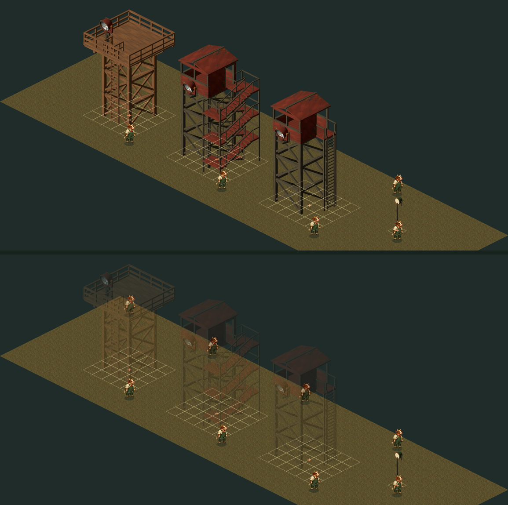
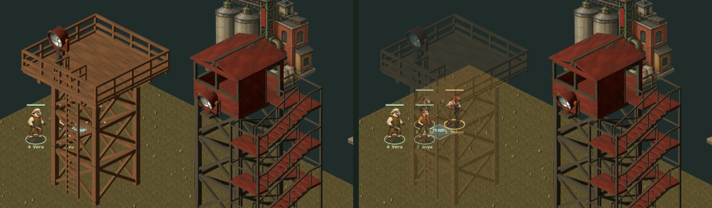

# Guard towers — parcel C

Parcel C of [SCENERY-PORT-HANDOFF.md](SCENERY-PORT-HANDOFF.md): the three canonical guard towers and
the `spotlight`, on the tiles the 3D editor puts them on. Art, placement and see-through only.
Nobody climbs a tower here, and no lamp shines (parcels I and J).



*Drawn by `environment-renderer.js` on the review page `dist/tactics/towers-art.html`. Pale diamonds
are footprints; orange crosses are footprint centres, the point each sprite is planted by. Top: the
three cows behind the towers are hidden. Bottom: the towers faded, as they do while you look behind
them.*

## What shipped

| kind | tiles | drawn at zoom 1 | residual the old anchor rule would have left | see-through |
| --- | --- | --- | --- | --- |
| `wooden-spotlight-tower` | 5 × 5 | 280 × 363 | floats 8.3 px | yes |
| `iron-searchlight-stair-tower` | 6 × 5 | 249 × 413 | sinks 10.0 px, 6.1 off-centre | yes |
| `iron-searchlight-ladder-tower` | 6 × 5 | 201 × 377 | floats 26.5 px, 17.9 off-centre | yes |
| `spotlight` | 1 × 1 | 29 × 109 | floats 3.7 px, 1.8 off-centre | no |

The rules are the 3D branch's, exactly. Its `core/environment.js` merges `LIGHT_PROPS` into `PROPS`,
and `light-sources.js` lists all four in `LIGHT_FORMS`, so each is `{w, h, solid: true, cover: 0}`,
and none is `tall`. The whole footprint blocks movement; nothing blocks sight. `spotlight` is here
because it is a map kind there: without it, a 3D map carrying one is refused.

A standing animal is 59 px tall at zoom 1, so a tower is six to seven animals tall. That is the 3D
line's world scale, the same as parcel B's, and open question 8 applies to both.

## Two decisions from the boss, 24 September 2026

1. **Relit bakes again, as a stated deviation.** There is still no image generator in this session.
   The sprites are `tools/bake-scenery.mjs --light=catalogue` renders, the rig parcel B calibrated
   against the painted catalogue (see [LIGHTING.md](LIGHTING.md)). Whether a render may ship is still
   **open question 9**. At 2.4 : 1, the tower downscale leaves far more detail than B's lamps at
   9–23 : 1, and the rig holds up at that size.
2. **Towers get out of the way like a wall would.** Asked how a three-story prop should sort and dim
   (open question 6), the boss answered with the behaviour: a tower goes translucent while you are
   trying to select something behind it.

## Placement: `foot`, a registration field in the renderer

The renderer used to plant every standing sprite by the bottom middle of its alpha box, `(w + h) * 5` px
below the footprint centre. Parcel B made its lamps fit that rule with two invisible marks. A tower
cannot be fitted to it:

- **The stair tower sinks.** Its stairs hang off one side, so its alpha box already ends 10 px below the
  anchor. Marks can only move a crop's bottom down, never up.
- **The ladder tower is 17.9 px off-centre** and floats 26.5 px, because its declared 6 × 5 footprint
  is not centred on the geometry. Marks could fix this one only by widening the crop a long way.

So the renderer now has the field that open question 5 asked for. `tools/catalog-environment.py` copies
each baked sprite's recorded footprint centre (`source.footCentre` in the side manifest) into its
catalog row as `foot`, in source pixels. `environment-renderer.js` plants a sprite that has a `foot` by
that point, exactly on the footprint centre, and mirrors it about that point when the prop is rotated.
A sprite without one is drawn exactly as before, and a test holds the old rule to 1e-9 px on four
painted props in both orientations.

`propPlacement` is the one function both paths go through. `propScreenBox` gives the same box on screen,
mirrored, for the see-through test.

**Checked, by what the renderer draws rather than by re-deriving the formula.** The test stubs `Image`,
hands `environmentRenderer().prop` a canvas context that records its transforms, and maps each sprite's
recorded `foot` through them:

- All four land on the footprint centre to 1e-9 px, in both orientations.
- Independently of the bake's bookkeeping, every tower's alpha box lies inside its own footprint
  diamond, to within 1.5 game px.
- The wooden tower is square and symmetric, so its front leg stands straight below the footprint centre
  on screen. The lowest band of solid pixels, which is that leg, is centred on the recorded foot within
  0.25 game px.

**Parcel B's lamps now carry `foot` too**, because the catalog tool copies it for any group whose manifest
records one. They are planted by it and no longer depend on their registration marks. The marks stay:
they are harmless, B's tests still hold them, and `--remark` still restores them.

## See-through

`see-through.js` holds the rule, and `app.js` calls it for any prop whose rule says `seeThrough: true`
(the three towers). A tower is drawn at alpha 0.3 while either of these holds:

- the cursor is over the tower's sprite and the ground tile under the cursor is behind it;
- the selected animal stands behind it, with its body inside the sprite.

"Behind" means outside the footprint and sorting before the footprint's front corner (`x + y` less
than the front corner's). That is also every tile the renderer paints under the tower, so a unit
standing beside a front face, which the single sprite wrongly covers, fades it too. Hovering the tower's
own footprint, or anything in front of it, does not fade it. The cursor's tile is found the way the game
already picks tiles, by projecting the cursor onto the ground, so pointing at a tower's cabin is pointing
at the ground far behind it, which is the case that needs the fade.



*The real game (`index.html?map=custom`, a playtest map with the wooden tower in front of the squad's
starts), shot headless. Left: the page's `environment-props-towers.js` served with `seeThrough`
removed; three of the four squad members are hidden behind the tower. Right: as shipped, with the
selected animal behind the tower, which fades.*

Clicking was never the problem. The game picks units from their own screen rectangles and tiles from
the ground, so a unit behind a tower could always be selected; it just could not be seen.

## Sorting and dimming: the rule, and its limits

- **One sprite, on the ground layer.** A tower is a ground prop, sorted at its front corner like every
  other prop, and dimmed with the ground whenever the player views floor 1 or 2. Nobody can stand on a
  tower here, so there is no upper floor of it to see.
- **A unit beside a front face** has a smaller `x + y` than the front corner, so it paints first and
  the tower's single sprite covers it. See-through covers that case whenever the player is looking at
  it. The correct fix is cutting the sprite into per-column strips that each sort at their own depth,
  which is a bigger change to `app.js` and was not taken (see "Not done").

## Not done

- **Climbing.** The plan said climbing "is not wired on either branch". That was already false on the
  3D branch when the plan was written: climb actions landed on 22 September (`4a49177`, "Add open tower
  windows, elevated lookouts and climb actions").

  There, a tower has four posts on top, 6.36 units up. A guard can start on one (`towerPost`), and a
  shell of open windows blocks sight and shots. Here, a tower is a solid footprint that blocks nothing
  above the ground.

  **A 3D map that starts a guard on a tower post is refused here**, with
  `Unit start needs a walkable floor at x,y`. The test pins that refusal and a control: the same guard on
  open ground loads.
- **Beams and emission:** parcels J and I. `lightMode` and a spotlight's `lightTargets` survive a load
  and a round trip, and are tested, so both parcels have something to read.
- **The fourteen gallery towers** are not map kinds on either branch: open question 1.
- **Per-column sorting**, above.
- **Mirroring flips the key light**, as for every painted prop, and puts the stair tower's stairs on the
  other side. On the 3D branch, rotation is a quarter turn, so a rotated tower there and here have their
  stairs on different sides, as with B's bedside table.

## Files this parcel touched

The Stage 1 Owns row for `towers`: `dist/assets/environment/towers/*`, `environment-props-towers.js`,
`prop-art-towers.js`, `manifest-towers.json`, `towers-art.html`, `art/towers-prompts.md`,
`tests/tactics-towers.test.mjs`, and this document with its two figures.

Outside it, under the boss's direction for see-through and the tools carve-out:

- `dist/tactics/environment-renderer.js`: the `foot` field, `propPlacement` and `propScreenBox`.
  Drawing without `foot` is unchanged, and the test holds it.
- `dist/tactics/app.js`: the see-through call, in three lines of `drawObjects`.
- `dist/tactics/see-through.js`: new, the rule itself.
- `tools/catalog-environment.py`: it copies `foot` from the side manifests. As a result,
  `prop-art-lighting.js` was regenerated and gained `foot`, and nothing else in it changed.
- `dist/tactics/environment-props-lighting.js`: its comment, which said this renderer could not draw a
  prop off its footprint centre.
- `SCENERY-PORT-HANDOFF.md`:
  - the claim and the status row;
  - C's delivered record;
  - the climbing correction;
  - notes under open questions 5, 6 and 9;
  - the tooling row.
- `SCENERY-BAKE.md`: `foot`, and what it now fixes. `LIGHTING.md`: the lamps' `foot`.
  `SCENERY-PORT-FIELD-NOTES.md`: traps from this parcel, each marked *(parcel C)*.

## Verification

- `npm run check` passes, 532 tests (525 before), plus the asset gate.
- Mutation round on the parcel, the renderer field and the see-through rule, run in a sandbox copy that
  passed unmutated first: 19 of 19 caught. The first run caught 17. The two survivors were a see-through
  fixture that was not level with the front corner as it claimed, and a drawn-box check that read only
  the binding side; both tests were fixed.
- The review page draws all four at zoom 0.6, 1, 1.15 and 2, in both orientations, with no console
  errors, and fades by the game's own rule under the pointer.
- The real game draws the towers and fades them, with no page errors; the one 404 is the game page's own
  `favicon.ico`.

## Reproducing the art

See [art/towers-prompts.md](../../art/towers-prompts.md). In short: serve the 3D branch at `b23334c`, then

```
node tools/bake-scenery.mjs --group=towers \
  --form=wooden-spotlight-tower,iron-searchlight-stair-tower,iron-searchlight-ladder-tower,spotlight \
  --light=catalogue --skin=honey --out=<scratch>
```

Copy the four PNGs into `dist/assets/environment/towers/`, carry `footCentre` and `gameScale` into
`manifest-towers.json`, and run `python tools/catalog-environment.py`. No `--register`: the towers are
planted by `foot`.
