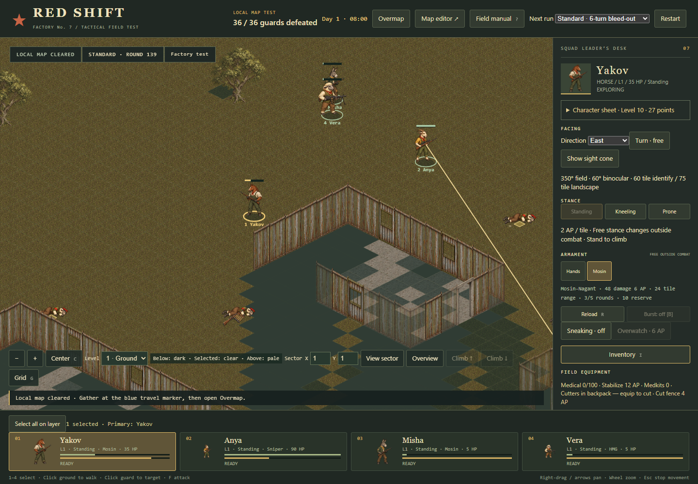

# South-fence live-browser playtest — 2026-09-17

**Victory: 36/36 guards defeated; all four mercs survived.** Standard difficulty, seed 1947, combat round 139, 10,264 driver steps (including individual enemy-AI ticks, not 10,264 player actions).

| Merc | Final HP | Final weapon | Loaded ammunition |
| --- | ---: | --- | ---: |
| Yakov | 35 | Rifle | 3 |
| Anya | 90 | Sniper rifle | 1 |
| Misha | 5 | Rifle | 4 |
| Vera | 5 | HMG | 32 |

## What actually happened

- Vera collected the HMG and its spare ammunition and equipped it at the start.
- The first rifleman was **already alerted when the map loaded**. He fired; Anya killed him with covering overwatch. The intended silent opening did not occur.
- The squad followed the western route via (30,45), (30,100), and (46,100). Misha cut `e:47:100` on round 27 and crossed to (49,100).
- The rear guard moved after the earlier shooting. The scripted attack pursued the displaced target and pulled Anya away from the group. This was a controller/cohesion weakness and delayed the approach.
- Southern route milestones: (68,105) on round 39; (70,145) on round 47; (94,145) on round 51.
- Positioning finished on round 59. The doorway overwatch stage ran, Misha advanced to (97,141) on round 60 and withdrew to (99,145) on round 61. The squad held through round 64 before switching to general scavenging/combat behavior. These are executed orders, not a claim that every enemy was successfully lured into the intended firing lane.
- Vera was downed and stabilized by Misha on round 65. Misha was later downed and stabilized by Yakov on round 112. Both recovered to 5 HP after the nearby encounter ended.
- The generic squad behavior recorded **17 successful scavenges**, five weapon equips, two stabilizations, and 22 overwatch reservations. These counts exclude scripted initial loadout and scripted overwatch events, which are recorded separately.
- Seventeen initially closed doors opened. The fence breach remained open. The final shot was Anya killing Guard 31 with the sniper rifle.
- No browser page errors were recorded.

## Lessons for the next run

1. Do not label the opening a stealth test: seeing the first guard at initial deployment already puts the map into contact. Investigate detection/alert semantics before claiming a silent kill is feasible from this spawn.
2. A rear-area objective should not follow a relocated guard indefinitely. Reassess the area and rally before advancing.
3. Require **all** surviving squad members to reach a rally radius before completing a waypoint. The current route advances when its lead merc arrives; that allowed separation.
4. Scavenging and stabilization were exercised successfully, and the HMG remained supplied through the final fight. This is one seeded run with multiple tactical changes; it does not isolate the HMG's effect on survival.
5. 139 combat rounds is still a pacing concern. Many were spent travelling or regrouping rather than exchanging fire.

## Evidence and reproduction

- [Full structured result](result.json): round/stage history, driver events, bot decisions, last 50 game-log messages, final state, map SHA-256, seed and game revision. It is not a complete per-shot transcript.
- [Exact input map](map.json): copied from the user's updated Factory-test.json; the original was not edited.
- Stage screenshots: [opening](opening.png), [south](south.png), [positioning](position.png), [ambush](ambush.png), [withdrawal](lure.png), [hold](hold.png), [clearing](clear.png), [final](final.png).
- [Initial harness stop](attempt-1.json): an aborted preliminary attempt at round 3. A legal group-movement interruption was mistakenly treated as terminal. The completed run was restarted from the original map after correcting the driver; it was not spliced together from outcomes.
- Runner: `tools/run-south-fence.cjs`; plan/controller: `tools/south-fence-driver.mjs`.

The run used **the browser game's actual state** in headless Edge. Only the test-served app's animation scheduling was replaced with action-driven ticks; the harness exposed state/render access without changing combat statistics, RNG, AP, ammunition, damage, or engine rules. The real-time campaign clock was paused. The automated player knows guard locations for navigation, including named scripted targets. After the scripted hold, normal automated scavenging/combat behavior completed the map.

To repeat without overwriting this record, serve `dist` on port 4341, set `MAP_FILE=docs/tactics/playtests/2026-09-17-south-fence/map.json`, then run `node tools/run-south-fence.cjs artifacts/south-fence-rerun`. `TACTICS_URL` overrides the local server URL. Playwright and headless Edge are required; `PLAYWRIGHT_MODULE` can select a Playwright installation.
